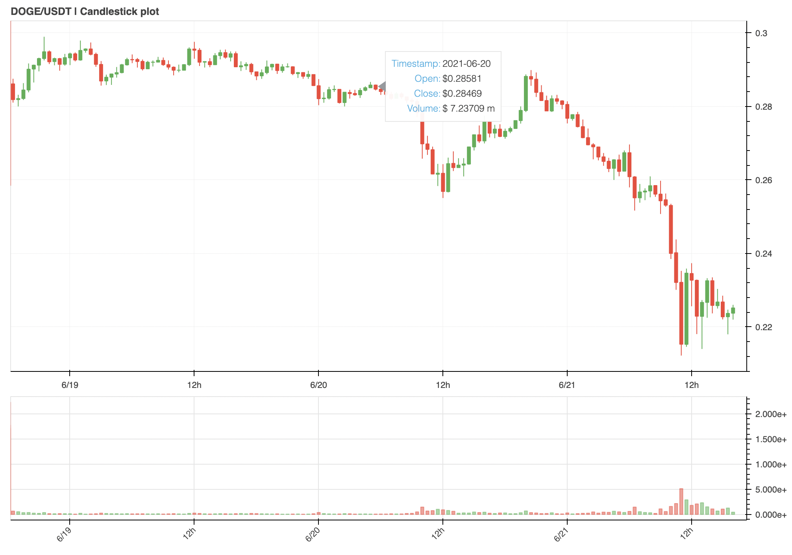

<p align="center">

</p>

<p align="center">

<!--  -->
<!--  -->


</p>

# Installation

```shell
$ pip install futon
```

# Usage

## Step 1: Initialize a data provider

A data provider refers to a source from where an instruments historical data can be fetched. Currently, **Binance** is the only supported provider (more are being added actively)

```python
from futon.data.providers import Binance

# Add your developer API keys here
api_key = '<API KEY>'
secret_key = '<API SECRET>'

binance = Binance(api_key, secret_key)
```

## Step 2: Choose an instrument

```python
coin = futon.instruments.Crypto(base_asset = 'DOGE',
                                quote_asset = 'USDT',
                                provider = binance,
                                interval = '30-min',
                                start_date = '2021-05-01 00:00:00')
```

When you initialize an instrument, historical data for the instrument is downloaded by _default_

If you're a chart guy, then you can create an interactive OHLCV chart right in your jupyter notebook:

```python
from bokeh.io import output_notebook, show, push_notebook
output_notebook()

coin.plot_candles()
```



## Step 3: Create a trading strategy

```python
from futon.strategy import TradingStrategy

class MACDCrossover(TradingStrategy):
    def setup(self):
        self.macd = futon.indicators.MACD(fastperiod = 6,
                                            slowperiod = 18,
                                            signalperiod = 5,
                                            plot_separately = True)

        self.indicators = [self.macd]

    def logic(self, account, lookback):
        try:
            today = lookback.iloc[-1]

            macd_today, signal_today, _ = self.macd.lookback[-1]
            macd_yest, signal_yest, _ = self.macd.lookback[-2]

            # Buying
            buy_signal = (macd_today > signal_today) and (macd_yest < signal_yest)
            if buy_signal:
                entry_price   = today.close
                entry_capital = account.buying_power
                account.buy(entry_capital=entry_capital, entry_price=entry_price)

            # Selling
            sell_signal = (macd_today < signal_today) and (macd_yest > signal_yest)

            if sell_signal:
                percent = 1
                exit_price = today.close
                account.sell(percent=percent, current_price=exit_price)

        except Exception as e:
            print('ERROR:', e)

strat = MACDCrossover(coin)
```

## Step 4: Run a backtest on historical data

```python
strat.backtest(start_date = '2021-06-1 00:00:00', commision = 0.001, show_trades = True)
```

**Output**

```
Performing backtest from: 01 June, 2021 (00:00:00) to 21 June, 2021 (16:00:00)

-------------- Results ----------------

Relative Returns: -2.55%
Relative Profit: -25.49

Strategy     : -36.4%
Net Profit   : -363.96

Buy and Hold : -33.85%
Net Profit   : -338.47

Buys        : 75
Sells        : 75
--------------------
Total Trades : 150

---------------------------------------
```


